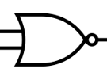

# Sample Verilog

This is an example Verilog project used in Daytona.

---

## 🚀 Getting Started  

### Open Using Daytona  

1. **Install Daytona**: Follow the [Daytona installation guide](https://www.daytona.io/docs/installation/installation/).  
2. **Create the Workspace**:  
   ```bash  
   daytona create https://github.com/daytonaio/sample-verilog/
   ```
3. **Look at the circuit**


It's a [substitution box (S-box)](https://en.wikipedia.org/wiki/S-box) consisting of 8 interconnected logic gates, including 4 NOR and 4 XOR. The circuit takes a 4-bit input x and produces a 4-bit output y.

Architecture:


- First level with  NOR gates. Intermediate signal w:

```
w(3) = x(3) nor x(2)
w(2) = x(2) nor x(1)
w(1) = x(1) nor y(3)    # Look at feedback with y(3)
w(0) = y(3) nor y(2)    # Look at feedback with y(3) and y(2)
```

and

- Second level with  XOR gates. Output signal y:

```
y(3) = x(0) xor w(3)
y(2) = x(3) xor w(2)
y(1) = x(2) xor w(1)
y(0) = x(1) xor w(0)
```

Look at [circuit.v](circuit.v) Verilog code.

4. **Compile the circuit**:  
   ```bash  
   iverilog -o circuit circuit.v
   ```  
5. **Start the Application**:
   ```bash  
   vvp circuit
   ```
It should displays

```
Time=0
IN  x=1000
    w=0111
OUT y=0011

Test 1 passed: y = 0011
Time=10
IN  x=1010
    w=0000
OUT y=0101

Test 2 result: y = 0101
Test complete
```

---

## ✨ Features  

standardized development environment with devcontainers

console application
